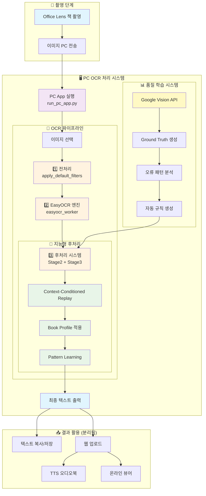
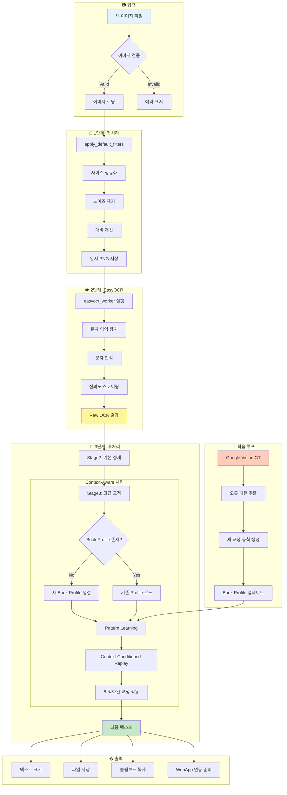

# SnapTXT OCR 시스템 구성도

## 1. 전체 시스템 개요

```mermaid
graph TB
    subgraph "📱 촬영 단계"
        A[Office Lens 책 촬영] --> B[이미지 PC 전송]
    end
    
    subgraph "🖥️ PC OCR 처리 시스템"
        B --> C[PC App 실행<br/>run_pc_app.py]
        C --> D[이미지 선택]
        
        subgraph "🔧 OCR 파이프라인"
            D --> E[1️⃣ 전처리<br/>apply_default_filters]
            E --> F[2️⃣ EasyOCR 엔진<br/>easyocr_worker]
            F --> G[3️⃣ 후처리 시스템<br/>Stage2 + Stage3]
            
            subgraph "🧠 지능형 후처리"
                G --> H[Context-Conditioned Replay]
                H --> I[Book Profile 적용]
                I --> J[Pattern Learning]
            end
        end
        
        subgraph "📊 품질 학습 시스템"
            K[Google Vision API] --> L[Ground Truth 생성]
            L --> M[오류 패턴 분석]
            M --> N[자동 규칙 생성]
            N --> G
        end
        
        J --> O[최종 텍스트 출력]
    end
    
    subgraph "📤 결과 활용 (분리됨)"
        O --> P[텍스트 복사/저장]
        O --> Q[웹 업로드]
        Q --> R[TTS 오디오북]
        Q --> S[온라인 뷰어]
    end

    style A fill:#e1f5fe
    style C fill:#f3e5f5
    style E fill:#fff3e0
    style F fill:#fff3e0
    style G fill:#fff3e0
    style H fill:#e8f5e8
    style I fill:#e8f5e8
    style J fill:#e8f5e8
    style K fill:#fff9c4
    style O fill:#e1f5fe
```

## 2. OCR 처리 워크플로우 상세

```mermaid
graph TD
    subgraph "📷 입력"
        A[책 이미지 파일] --> B{이미지 검증}
        B -->|Valid| C[이미지 로딩]
        B -->|Invalid| A1[에러 표시]
    end
    
    subgraph "🔧 1단계: 전처리"
        C --> D[apply_default_filters]
        D --> E[사이즈 정규화]
        E --> F[노이즈 제거]
        F --> G[대비 개선]
        G --> H[임시 PNG 저장]
    end
    
    subgraph "👁️ 2단계: EasyOCR"
        H --> I[easyocr_worker 실행]
        I --> J[문자 영역 탐지]
        J --> K[문자 인식]
        K --> L[신뢰도 스코어링]
        L --> M[Raw OCR 결과]
    end
    
    subgraph "🧠 3단계: 후처리"
        M --> N[Stage2: 기본 정제]
        N --> O[Stage3: 고급 교정]
        
        subgraph "Context-Aware 처리"
            O --> P{Book Profile 존재?}
            P -->|No| Q[새 Book Profile 생성]
            P -->|Yes| R[기존 Profile 로드]
            Q --> S[Pattern Learning]
            R --> S
            S --> T[Context-Conditioned Replay]
            T --> U[최적화된 교정 적용]
        end
        
        U --> V[최종 텍스트]
    end
    
    subgraph "📊 학습 루프"
        W[Google Vision GT] --> X[오류 패턴 추출]
        X --> Y[새 교정 규칙 생성]
        Y --> Z[Book Profile 업데이트]
        Z --> S
    end
    
    subgraph "📤 출력"
        V --> V1[텍스트 표시]
        V --> V2[파일 저장]
        V --> V3[클립보드 복사]
        V --> V4[WebApp 연동 준비]
    end

    style A fill:#e3f2fd
    style M fill:#fff59d
    style V fill:#c8e6c9
    style W fill:#ffccbc
```