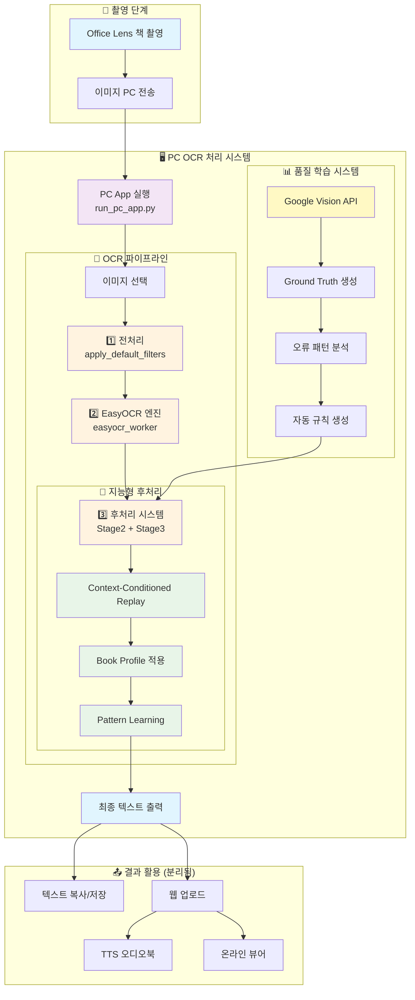

# SnapTXT 전체 시스템 구성도

```mermaid
graph TB
    subgraph "📱 촬영 단계"
        A[Office Lens 책 촬영] --> B[이미지 PC 전송]
    end
    
    subgraph "🖥️ PC OCR 처리 시스템"
        B --> C[PC App 실행<br/>run_pc_app.py]
        C --> D[이미지 선택]
        
        subgraph "🔧 OCR 파이프라인"
            D --> E[1️⃣ 전처리<br/>apply_default_filters]
            E --> F[2️⃣ EasyOCR 엔진<br/>easyocr_worker]
            F --> G[3️⃣ 후처리 시스템<br/>Stage2 + Stage3]
            
            subgraph "🧠 지능형 후처리"
                G --> H[Context-Conditioned Replay]
                H --> I[Book Profile 적용]
                I --> J[Pattern Learning]
            end
        end
        
        subgraph "📊 품질 학습 시스템"
            K[Google Vision API] --> L[Ground Truth 생성]
            L --> M[오류 패턴 분석]
            M --> N[자동 규칙 생성]
            N --> G
        end
        
        J --> O[최종 텍스트 출력]
    end
    
    subgraph "📤 결과 활용 (분리됨)"
        O --> P[텍스트 복사/저장]
        O --> Q[웹 업로드]
        Q --> R[TTS 오디오북]
        Q --> S[온라인 뷰어]
    end

    style A fill:#e1f5fe
    style C fill:#f3e5f5
    style E fill:#fff3e0
    style F fill:#fff3e0
    style G fill:#fff3e0
    style H fill:#e8f5e8
    style I fill:#e8f5e8
    style J fill:#e8f5e8
    style K fill:#fff9c4
    style O fill:#e1f5fe
```