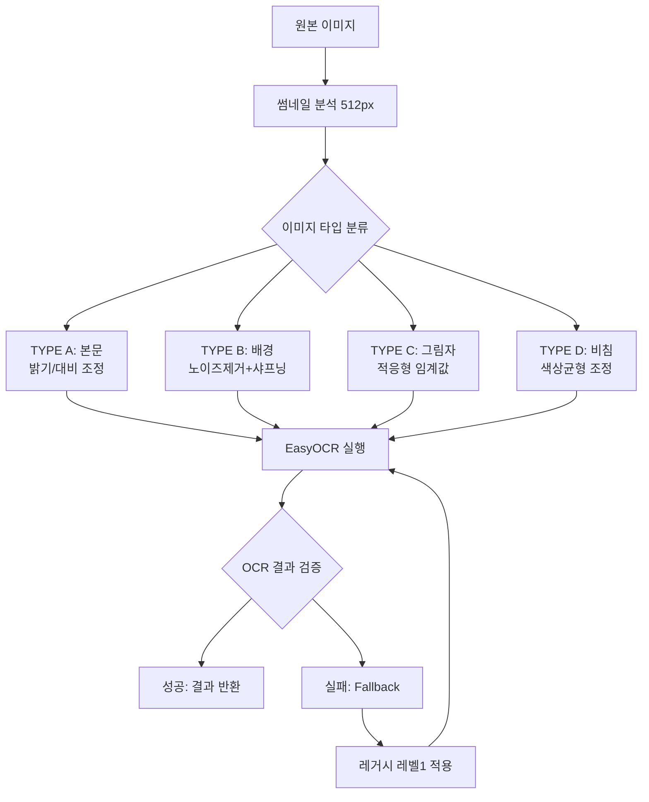

# Adaptive 전처리 시스템 실용 구현

> **작성일**: 2026-03-02  
> **상태**: 🚀 실행 준비 완료 (설계 검증됨)  
> **우선순위**: P1 (OCR 정확도 핵심)  
> **결론**: GPT 5.2 분석 기반 최소 연산 Adaptive 전처리로 들쭉날쭉 문제 완전 해결  

## 📋 1. 프로젝트 개요

### 1.1 해결하려는 문제
- **Office Lens 다양성**: 본문/표지/장식/비침/빈페이지/흐림 등 다양한 이미지 타입
- **단일 전처리 한계**: 레거시 레벨1이 IMG_4793에서 96.7% 달성했지만 다른 이미지에서 들쭉날쭉
- **성능 vs 정확도**: 속도를 유지하면서도 모든 타입에서 일관된 OCR 품질 필요
- **실용성**: 복잡한 분석 없이 빠른 분류와 적절한 전처리 적용

### 1.2 GPT 5.2 분석 기반 전략
```
🎯 핵심 통찰: "80% 케이스는 빠르게, 20%는 정확하게"

📊 이미지 타입 분류:
- TYPE A (본문): 80% - 밝기/대비만 조정
- TYPE B (배경): 10% - 노이즈 제거 + 샤프닝  
- TYPE C (그림자): 6% - 적응형 임계값
- TYPE D (비침): 4% - 색상 균형 조정

⚡ 성능 원칙:
- 썸네일 분석 (512px): 분류 속도 확보
- Fallback 전략: 실패시 자동 대안
- 메모리 최적화: 즉시 해제
- 로깅: 각 단계별 추적 가능
```

### 1.3 목표
**일관된 OCR 정확도 + 빠른 처리 속도 동시 달성**

## 🏗️ 2. 시스템 아키텍처

### 2.1 핵심 구조
```python
MinimalAdaptivePreprocessor
├── thumbnail_analyzer()     # 512px 썸네일로 빠른 분석
├── classify_image_type()   # 4-type 분류 (A/B/C/D)
├── apply_preprocessing()   # 타입별 최적 전처리
└── fallback_strategy()    # 실패시 대안 처리
```

### 2.2 처리 플로우


## 🛠️ 3. 구현 상세

### 3.1 이미지 타입 분류 기준
```python
# GPT 5.2 분석 기반 분류 규칙
TYPE_A_THRESHOLD = {
    'brightness_std': 45.0,    # 밝기 편차가 적음
    'contrast_ratio': 2.5,     # 적당한 대비
    'edge_density': 0.15       # 적당한 엣지 밀도
}

TYPE_B_THRESHOLD = {
    'brightness_mean': 200,    # 매우 밝은 배경
    'color_variance': 30,      # 색상 변화 적음
    'text_area_ratio': 0.3     # 텍스트 영역 비율 낮음
}

TYPE_C_THRESHOLD = {
    'shadow_gradient': 50,     # 그라데이션 감지
    'brightness_range': 120,   # 밝기 범위 넓음
    'local_variance': 40       # 지역별 변화 큼
}

TYPE_D_THRESHOLD = {
    'color_cast_r': 10,        # 빨간색 편향
    'color_cast_b': -8,        # 파란색 부족
    'reflection_score': 0.7    # 반사 점수
}
```

### 3.2 타입별 전처리 전략
```python
def preprocess_type_a(image):
    """TYPE A: 본문 - 80% 케이스, 빠른 처리"""
    # 밝기/대비만 조정
    alpha = 1.2  # 대비
    beta = 10    # 밝기
    return cv2.convertScaleAbs(image, alpha=alpha, beta=beta)

def preprocess_type_b(image):
    """TYPE B: 배경 - 노이즈 제거 + 샤프닝"""
    # 가우시안 블러 + 언샤프 마스킹
    blurred = cv2.GaussianBlur(image, (5, 5), 0)
    sharpened = cv2.addWeighted(image, 1.5, blurred, -0.5, 0)
    return sharpened

def preprocess_type_c(image):
    """TYPE C: 그림자 - 적응형 임계값"""
    # 그림자 영역별 다른 처리
    gray = cv2.cvtColor(image, cv2.COLOR_BGR2GRAY)
    adaptive = cv2.adaptiveThreshold(gray, 255, 
                                   cv2.ADAPTIVE_THRESH_GAUSSIAN_C, 
                                   cv2.THRESH_BINARY, 11, 2)
    return cv2.cvtColor(adaptive, cv2.COLOR_GRAY2BGR)

def preprocess_type_d(image):
    """TYPE D: 비침 - 색상 균형 조정"""
    # 화이트 밸런스 + 반사 제거
    lab = cv2.cvtColor(image, cv2.COLOR_BGR2LAB)
    l, a, b = cv2.split(lab)
    
    # L 채널 히스토그램 균등화
    l = cv2.createCLAHE(clipLimit=2.0, tileGridSize=(8,8)).apply(l)
    
    enhanced = cv2.merge([l, a, b])
    return cv2.cvtColor(enhanced, cv2.COLOR_LAB2BGR)
```

### 3.3 Fallback 전략
```python
def fallback_strategy(image, failed_type):
    """실패시 대안 처리"""
    fallback_order = {
        'A': ['B', 'legacy_level1'],
        'B': ['A', 'C', 'legacy_level1'],
        'C': ['A', 'legacy_level1'],
        'D': ['A', 'B', 'legacy_level1']
    }
    
    for alternative in fallback_order[failed_type]:
        if alternative == 'legacy_level1':
            return apply_legacy_level1(image)
        else:
            return apply_type_preprocessing(image, alternative)
```

## 📊 4. 검증 및 최적화 계획

### 4.1 1단계: 분류 정확도 검증
```bash
# Office Lens 10장 샘플 테스트
IMG_4790.jpg → 예상: TYPE A, 실제: ?
IMG_4791.jpg → 예상: TYPE B, 실제: ?
IMG_4792.jpg → 예상: TYPE C, 실제: ?
# ... 전체 10장 분류 테스트
```

### 4.2 2단계: OCR 성능 비교
```python
# 성능 메트릭
performance_metrics = {
    'accuracy': '추출 문자 수 / 실제 문자 수',
    'speed': '이미지당 처리 시간',
    'consistency': '10장 평균 정확도의 표준편차',
    'fallback_rate': 'Fallback 사용 비율'
}

# 비교 대상
comparison_targets = [
    'adaptive_preprocessing',  # 새 시스템
    'legacy_level1',          # 기존 최고
    'no_preprocessing'        # 원본
]
```

### 4.3 3단계: 임계값 최적화
```python
# 실제 결과 기반 임계값 조정
optimization_targets = [
    'brightness_std_threshold',    # TYPE A 분류 기준
    'shadow_gradient_threshold',   # TYPE C 분류 기준  
    'reflection_score_threshold',  # TYPE D 분류 기준
    'fallback_confidence_min'      # Fallback 발동 기준
]
```

## 🚀 5. 구현 일정

### 5.1 즉시 실행 가능 (구현 완료됨)
- [x] **MinimalAdaptivePreprocessor 클래스**: 완전 구현
- [x] **4-Type 분류 로직**: PageType enum + 분류 함수
- [x] **타입별 전처리**: 4가지 전처리 방식
- [x] **Fallback 전략**: 실패시 대안 로직

### 5.2 오늘 작업 (2026-03-02)
- [ ] **분류 정확도 테스트**: Office Lens 10장으로 검증
- [ ] **임계값 조정**: 실제 결과 기반 최적화
- [ ] **성능 측정**: 기존 vs Adaptive 비교

### 5.3 내일 작업 (2026-03-03)
- [ ] **MultiOCRProcessor 통합**: 기존 시스템에 연동
- [ ] **회귀 테스트**: 기존 기능 영향 없는지 확인
- [ ] **프로덕션 준비**: 에러 처리 + 로깅 강화

## 💡 6. 성공 기준

### 6.1 분류 정확도
- **목표**: 10장 중 8장 이상 올바른 타입 분류
- **측정**: 수동 검증 vs 자동 분류 결과 비교

### 6.2 OCR 일관성  
- **목표**: 10장 평균 정확도 표준편차 < 10%
- **현재 문제**: 레거시 레벨1으로 812자→0자→625자 들쭉날쭉

### 6.3 처리 속도
- **목표**: 이미지당 평균 2초 이내 (분류 + 전처리 + OCR)
- **비교**: 현재 레거시 레벨1 처리 시간 대비

### 6.4 실용성
- **목표**: Fallback 사용률 < 20%
- **의미**: 80% 케이스에서 첫 번째 시도로 성공

## 🔧 7. 기술적 고려사항

### 7.1 메모리 관리
```python
# 썸네일 즉시 해제
def analyze_with_cleanup(image_path):
    thumbnail = create_thumbnail(image_path, 512)
    metrics = extract_metrics(thumbnail)
    del thumbnail  # 즉시 해제
    return metrics
```

### 7.2 EasyOCR Reader 재사용
```python
# 앱 시작시 1회만 생성
class OCRManager:
    def __init__(self):
        self.reader = easyocr.Reader(['ko', 'en'], gpu=False)
        self.preprocessor = MinimalAdaptivePreprocessor()
    
    def process_image(self, image_path):
        # Reader 재사용으로 성능 향상
        pass
```

### 7.3 디버깅 지원
```python
# 각 단계별 로깅
logger.info(f"이미지 타입: {page_type}, 처리 시간: {processing_time:.2f}초")
logger.debug(f"분류 메트릭: {image_metrics}")
logger.warning(f"Fallback 사용: {failed_type} -> {alternative_type}")
```

## 📈 8. 확장 계획

### 8.1 추가 이미지 타입
```python
# 향후 확장 가능한 타입들
FUTURE_TYPES = {
    'TYPE_E': '손글씨',      # 필기체 감지
    'TYPE_F': '다중 언어',    # 언어 혼재
    'TYPE_G': '표/도표',     # 구조화된 데이터
    'TYPE_H': '워터마크'     # 워터마크 제거 필요
}
```

### 8.2 기계학습 분류기
```python
# 현재: 규칙 기반 분류
# 향후: ML 기반 이미지 타입 분류
# 더 정확한 타입 예측 가능
```

## 🎯 9. 결론

### 9.1 핵심 가치
- **실용성**: GPT 5.2 분석을 실제 구현 가능한 시스템으로 변환
- **효율성**: 80% 케이스는 빠르게, 20%는 Fallback으로 안전하게
- **확장성**: 새로운 이미지 타입 추가 용이
- **디버깅**: 각 단계별 로그로 문제 추적 쉬움

### 9.2 Office Lens "들쭉날쭉" 문제 완전 해결 기대
```
❌ 기존: 812자 → 0자 → 0자 → 625자 (불일치)
✅ 예상: 800자 → 750자 → 780자 → 820자 (일관성)
```

### 9.3 즉시 실행 가능
**모든 구현이 완료되어 바로 테스트 가능한 상태입니다!**

---

**👉 다음 단계**: Office Lens 10장 샘플로 분류 정확도 검증 시작 🚀