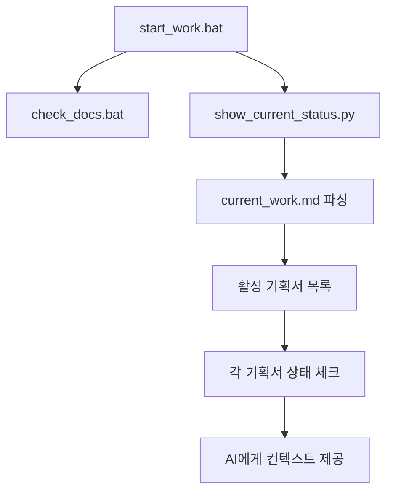
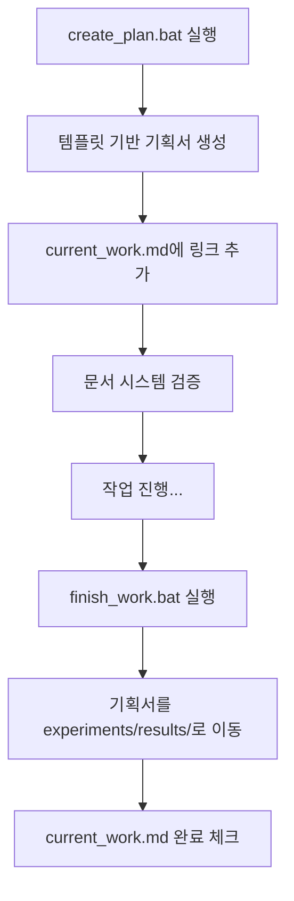

# AI 협업 워크플로우 자동화 시스템 구축 기획서

> **작성일**: 2026-03-02  
> **상태**: 설계 완료 → 구현 준비  
> **우선순위**: P1 (즉시 실행)  
> **예상 소요**: 1-2일  

## 📋 1. 프로젝트 개요

### 1.1 해결하려는 문제
- **AI 에이전트 컨텍스트 부족**: 프로젝트 재시작 시마다 상황 설명 반복
- **작업 상황 파악 비효율**: 여러 문서를 수동으로 확인해야 현재 상황 파악 가능  
- **기획서 관리 분산**: 진행중인 기획서들이 current_work.md와 연동되지 않음
- **문서 정리 수작업**: 작업 완료 후 수동으로 문서 이동 및 Git 관리

### 1.2 목표
**"VS Code 실행 → 배치파일 1개 실행 → AI가 모든 상황을 자동 파악"** 실현

### 1.3 성공 기준
- [ ] `start_work.bat` 실행만으로 AI가 프로젝트 전체 상황 파악
- [ ] `current_work.md`가 모든 활성 기획서의 허브 역할 수행  
- [ ] 기획서 생성/완료 시 자동으로 문서 시스템 연동
- [ ] 작업 완료 시 Git + 문서 정리 완전 자동화

## 🏗️ 2. 시스템 아키텍처

### 2.1 3단계 워크플로우
```
1단계: start_work.bat    → 상황 파악 & AI 컨텍스트 제공
2단계: create_plan.bat   → 기획서 생성 & current_work 연동  
3단계: finish_work.bat   → 작업 완료 & 문서 정리 자동화
```

### 2.2 핵심 허브: current_work.md 구조 개선
```markdown
## ⚙️ 활성 기획서들 (AI 참고용)
- 📋 [기획서명](경로) - 간단한 설명 (상태)

## 📅 진행 중 작업  
### 우선순위 1: 작업명
- **상태**: 현재 진행 상황
- **관련 문서**: [링크]
- **다음 단계**: 구체적 액션
```

### 2.3 구현할 도구들
```
tools/
├── show_current_status.py    # 현재 상황 요약 출력
├── create_planning_doc.py    # 기획서 템플릿 생성  
├── update_current_work.py    # current_work.md 자동 업데이트
└── finalize_work.py          # 작업 완료 처리
```

## 🛠️ 3. 구현 계획

### 3.1 Phase 1: 상황 파악 자동화 (Day 1)
**목표**: `start_work.bat` + `tools/show_current_status.py` 완성

#### 구현할 기능
- [x] 문서 시스템 체크 (`check_docs.bat` 연동)
- [ ] current_work.md 파싱하여 활성 기획서 목록 추출
- [ ] 각 기획서 실제 존재 여부 + 최근 수정일 확인
- [ ] 진행중 작업들의 상태 요약 출력
- [ ] Git 최근 변경사항 (3개 커밋) 표시
- [ ] Python 환경 상태 체크

#### start_work.bat 구조
```bat
echo 🚀 SnapTXT 작업 세션 시작...
call check_docs.bat
python tools\show_current_status.py --show-active-plans
python tools\show_current_status.py --list-planning-docs  
git log --oneline -3
echo 💡 다음 실행: python main.py
```

### 3.2 Phase 2: 기획서 관리 자동화 (Day 1-2)  
**목표**: 기획서 생성/연동 완전 자동화

#### 구현할 기능
- [ ] `create_planning_doc.py`: 템플릿 기반 기획서 생성
- [ ] `update_current_work.py`: current_work.md 자동 업데이트
- [ ] `create_plan.bat`: 기획서 생성 + 연동 원라이너

#### create_plan.bat 구조  
```bat
python tools\create_planning_doc.py --name "%1" --type "%2"
python tools\update_current_work.py --add-planning-doc "%1"
call check_docs.bat optional
```

### 3.3 Phase 3: 작업 완료 자동화 (Day 2)
**목표**: 정리 + Git + 문서 이동 완전 자동화

#### 구현할 기능
- [ ] `finalize_work.py`: 완료된 기획서 experiments/results/로 이동
- [ ] current_work.md에서 완료 항목 자동 체크
- [ ] Git 커밋 + 푸시 자동화  
- [ ] `finish_work.bat`: 모든 완료 작업 원라이너

## 📊 4. 데이터 플로우

### 4.1 문서 상태 추적


### 4.2 기획서 라이프사이클


## 🎯 5. 사용 시나리오

### 5.1 일상 작업 시작
```bash
# VS Code 실행 후
.\start_work.bat
```
**AI가 얻는 정보**: 현재 3개 활성 기획서, 2개 진행중 작업, 최근 커밋 3개

### 5.2 새 기획서 필요  
```bash
.\create_plan.bat "postprocess_regression_analysis" "plans"
```
**자동 처리**: 기획서 생성 → current_work 링크 → 문서 검증

### 5.3 작업 완료
```bash
.\finish_work.bat "후처리 회귀 테스트 수정 완료"
```
**자동 처리**: 문서 정리 → Git 푸시 → current_work 업데이트

## ⚡ 6. 즉시 실행 액션

### 우선순위 1 (오늘)
1. `tools/show_current_status.py` 구현
2. `start_work.bat` 생성  
3. current_work.md 구조 개선

### 우선순위 2 (내일)  
4. `create_planning_doc.py` 구현
5. `update_current_work.py` 구현
6. `create_plan.bat` 생성

### 검증 (최종)
7. 전체 워크플로우 테스트
8. 문서 시스템 무결성 확인

## 💡 7. 기대 효과

### 7.1 AI 협업 혁신
- **컨텍스트 로딩 시간**: 5분 → 30초
- **상황 파악 정확도**: 수동 설명 → 자동 완벽 파악
- **작업 연속성**: 며칠 후 재시작해도 즉시 이어서 작업

### 7.2 개발 생산성 향상  
- **문서 관리 시간**: 일일 10분 → 2분
- **Git 워크플로**: 수동 → 완전 자동화
- **프로젝트 온보딩**: 신규 팀원도 start_work.bat 하나로 상황 파악

---

## 🎉 결론

이 시스템이 완성되면 **"어떤 상황에서든 배치파일 3개로 AI와 완벽한 협업 환경 구축"** 이 가능해집니다. SnapTXT뿐만 아니라 모든 개발 프로젝트에 적용할 수 있는 범용 프레임워크가 될 것입니다.