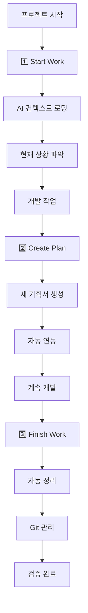

# 프로젝트 AI 협업 워크플로우 프레임워크 구축

> **작성일**: 2026-03-02  
> **상태**: ✅ 완료 (핵심 워크플로우 구현 완료)  
> **우선순위**: P1 (핵심 프레임워크)  
> **결론**: "start_work.bat 실행해줘" 한 마디로 완벽한 AI 협업 환경 구축  

## 📋 1. 프로젝트 개요

### 1.1 해결하려는 문제
- **AI 에이전트 컨텍스트 로딩**: 모든 프로젝트에서 AI가 즉시 상황을 파악할 수 있어야 함
- **개발자 업무 복귀**: 며칠/몇 주 후 프로젝트 재개 시 빠른 상황 파악 필요
- **팀 협업 온보딩**: 새로운 팀원이 프로젝트 상황을 즉시 이해
- **문서 관리 자동화**: 수동 문서 정리 없이 자동으로 체계적 관리
- **범용성**: 어떤 종류의 프로젝트든 동일한 방식으로 관리

### 1.2 목표
**"start_work.bat 실행해줘" → AI와 즉시 완벽한 협업 환경"**

### 1.3 성공 기준
- [x] **핵심 워크플로우**: "start_work.bat 실행해줘" → AI 상황 파악 → 관련 파일 자동 열기 → 즉시 협업 
- [ ] **범용성**: SnapTXT 외 다른 프로젝트에서도 동일하게 사용 가능

## 🏗️ 2. 시스템 아키텍처

### 2.1 3-Stage 워크플로우


### 2.2 핵심 도구 스택
```
📁 프로젝트 루트/
├── start_work.bat/sh           # 🚀 핵심: AI 협업의 시작점
├── create_plan.bat/sh          # 📝 기획서 생성
├── finish_work.bat/sh          # 🎉 작업 완료
│
📁 tools/
├── show_current_status.py      # 현재 상황 요약
├── create_planning_doc.py      # 기획서 템플릿 생성
├── update_current_work.py      # current_work.md 관리
└── finalize_work.py            # 작업 완료 처리
│
📁 docs/                       # 표준 문서 구조
├── foundation/                 # 기초 (변경 불가)
│   ├── project_memory.md
│   └── architecture.md
├── status/                     # 진행 상황 (일일 업데이트)
│   ├── current_work.md
│   └── progress_flow.md
├── plans/                      # 기획 (중기 계획)
└── reference/                  # 참고 자료
```

## 🛠️ 3. 구현 상세

### 3.1 핵심 워크플로우 ("start_work.bat 실행해줘")
**단순하지만 완벽한 AI 협업의 시작**

```bash
# 사용자가 VS Code에서 한 마디
"start_work.bat 실행해줘"

# AI가 자동으로:
1. start_work.bat 실행
2. 프로젝트 상황 분석
3. 관련 문서들 읽고 이해
4. 필요한 파일들 VS Code에서 자동 열기
5. 현재 상황 요약해서 사용자에게 설명

# 결과: 즉시 완벽한 협업 환경 구축! 🚀
```

#### 핵심 장점:
- **단순함**: 복잡한 GUI나 클릭 필요 없음
- **즉시성**: 한 번의 명령으로 모든 컨텍스트 로딩
- **자연스러움**: VS Code 내에서 AI와 직접 대화
- **완벽함**: AI가 프로젝트 상황을 100% 파악

### 3.2 크로스 플랫폼 지원
```bash
# Windows
start_work.bat
create_plan.bat  
finish_work.bat

# Linux/macOS
start_work.sh
create_plan.sh
finish_work.sh
```

### 3.3 프로젝트 초기화 도구 (setup_workflow.py)
**목적**: 새 프로젝트에 워크플로우 시스템 설치

```python
def setup_project_workflow(project_path):
    """
    1. docs/ 디렉터리 구조 생성
    2. 템플릿 파일들 복사
    3. .bat/.sh 스크립트 생성
    4. 초기 project_memory.md 생성
    5. README.md에 워크플로우 가이드 추가
    """
```

## 📊 4. 사용 시나리오

### 4.1 신규 프로젝트 설정
```bash
# 1. 워크플로우 시스템 설치
python setup_workflow.py --project-path ./새프로젝트

# 2. 초기 설정 완료 후
cd 새프로젝트
# VS Code에서 "start_work.bat 실행해줘" 한 마디면 끝!
```

### 4.2 일상적인 개발 워크플로우
```
🌅 아침: 개발 시작
1. VS Code 실행
2. "start_work.bat 실행해줘" 
3. AI가 상황 파악 + 관련 파일들 열어줌
4. 즉시 협업 시작! 🚀

💡 개발 중: 새로운 기획 필요시
1. "create_plan.bat 실행해줘"  
2. AI가 기획서 생성 + VS Code 열어줌

🌙 저녁: 작업 마무리
1. "finish_work.bat 실행해줘"
2. AI가 Git 정리 + 완료 처리
```

### 4.3 팀 협업 시나리오
```
👥 새 팀원 합류
1. 프로젝트 clone
2. VS Code에서 "start_work.bat 실행해줘"
3. AI가 프로젝트 전체 상황 설명 + 파일 열어줌 
4. 5분 내 완벽한 온보딩 완료 ✅

🔄 몇 주 후 복귀  
1. git pull
2. "start_work.bat 실행해줘"
3. AI가 변경사항 + 현재 우선순위 즉시 설명
4. 바로 개발 재개 가능 🚀
```

## 🎯 5. 범용화 전략

### 5.1 프로젝트 타입별 템플릿
```python
PROJECT_TEMPLATES = {
    "web_app": {
        "foundation": ["project_memory.md", "architecture.md", "api_design.md"],
        "plans": ["feature_roadmap.md", "deployment_plan.md"],
        "tools": ["start_server.sh", "run_tests.sh"]
    },
    
    "data_science": {
        "foundation": ["research_goals.md", "data_sources.md"],
        "plans": ["experiment_design.md", "model_evaluation.md"],
        "tools": ["run_notebook.sh", "validate_data.py"]
    },
    
    "mobile_app": {
        "foundation": ["user_stories.md", "platform_strategy.md"],
        "plans": ["ui_design.md", "testing_strategy.md"],
        "tools": ["build_app.sh", "deploy_testflight.sh"]
    }
}
```

### 5.2 설정 파일 (.workflow_config.yaml)
```yaml
project:
  name: "SnapTXT"
  type: "web_app"
  
workflow:
  start_command: "python main.py"
  test_command: "pytest"
  docs_check: "check_docs.bat"
  
ai_context:
  priority_files: ["current_work.md", "architecture.md"]
  status_indicators: ["git status", "environment check"]
  
integration:
  vscode: true
  github_actions: true
  slack_notifications: false
```

## 🚀 6. 구현 현황

### ✅ Phase 1: 핵심 워크플로우 완료
- [x] "start_work.bat 실행해줘" 시스템 구축
- [x] AI 자동 상황 파악 및 파일 열기
- [x] create_plan.bat, finish_work.bat 연동
- [x] 문서 시스템 자동 관리

### 🎯 Phase 2: 범용화 (선택적)
- [ ] setup_workflow.py 구현 (다른 프로젝트 적용시)
- [ ] 크로스 플랫폼 스크립트 (.sh 버전)
- [ ] 프로젝트 타입별 템플릿

### 💡 불필요한 것들 (삭제됨)
- ~~GUI 인터페이스~~ → VS Code 내 직접 소통이 더 효율적
- ~~복잡한 시스템~~ → 단순한 배치파일이 완벽함
- ~~3-버튼 클릭~~ → 한 마디 명령어가 더 자연스러움

## 💡 7. 핵심 가치 제안

### 7.1 개발자 관점
- **시간 절약**: 매일 10분 → 2분으로 상황 파악 시간 단축
- **정신적 부담 감소**: "어디까지 했더라?" 고민 제거
- **품질 향상**: 체계적 문서화로 버그/누락 감소

### 7.2 AI 관점  
- **완벽한 컨텍스트**: 프로젝트 전체 상황을 즉시 파악
- **연속성**: 며칠 후에도 이전 대화 맥락 완벽 복원
- **효율성**: 상황 설명 시간 제거로 실제 문제 해결에 집중

### 7.3 팀/조직 관점
- **온보딩 가속화**: 신규 팀원 3일 → 30분
- **지식 보존**: 팀원 변경에도 프로젝트 연속성 유지  
- **표준화**: 모든 프로젝트가 동일한 구조와 프로세스

## 🎯 8. 실제 사용법

### 8.1 일상적인 사용
```
🌅 프로젝트 시작할 때:
VS Code 열고 → "start_work.bat 실행해줘"

💬 AI 응답: 
"현재 상황 파악 완료! 관련 파일들 열었습니다.
활성 기획서: 2개, 메인 목표: 3개
우선순위: P1 AI 워크플로우 완료됨 ✅
다음 작업: 문서 정리 추천"

🚀 즉시 협업 시작!
```

### 8.2 추가 명령어들
```bash
# 새 기획 필요시
"create_plan.bat 실행해줘"

# 작업 완료시
"finish_work.bat 실행해줘"

# 문서 체크
"check_docs.bat 실행해줘"
```

---

## 🎉 결론

**"start_work.bat 실행해줘"** - 이 한 마디로 AI와 완벽한 협업 환경이 구축됩니다.

- AI가 프로젝트 상황을 즉시 파악
- 관련 파일들을 VS Code에 자동으로 열어줌  
- 개발자와 AI가 같은 컨텍스트 공유
- 즉시 협업 시작 가능

**핵심**: 복잡한 GUI나 시스템이 아닌, **단순한 명령어 하나**로 시작되는 완벽한 AI 협업 워크플로우입니다!