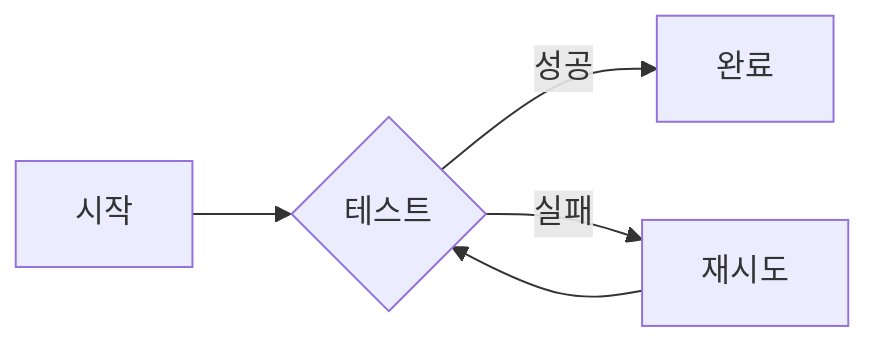
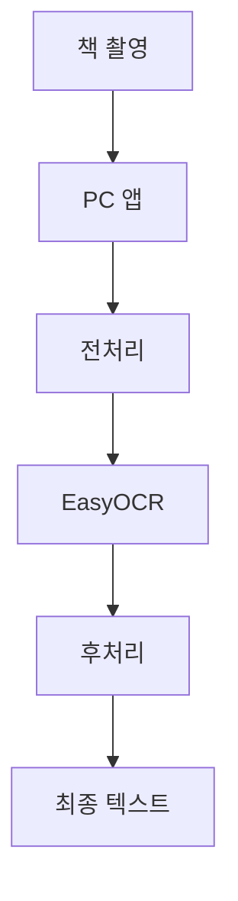

# Mermaid 테스트

## 간단한 플로우차트 테스트

```mermaid
graph LR
    A[시작] --> B{테스트}
    B -->|성공| C[완료]
    B -->|실패| D[재시도]
    D --> B
```

## SnapTXT 시스템 요약

```mermaid
graph TD
    A[책 촬영] --> B[PC 앱]
    B --> C[전처리]
    C --> D[EasyOCR]
    D --> E[후처리]
    E --> F[최종 텍스트]
```